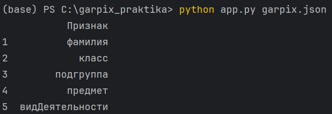
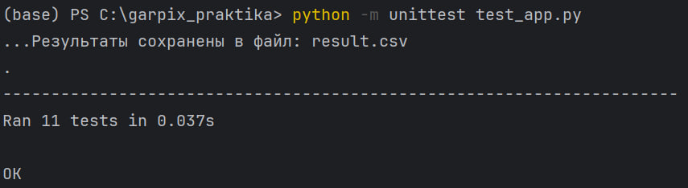
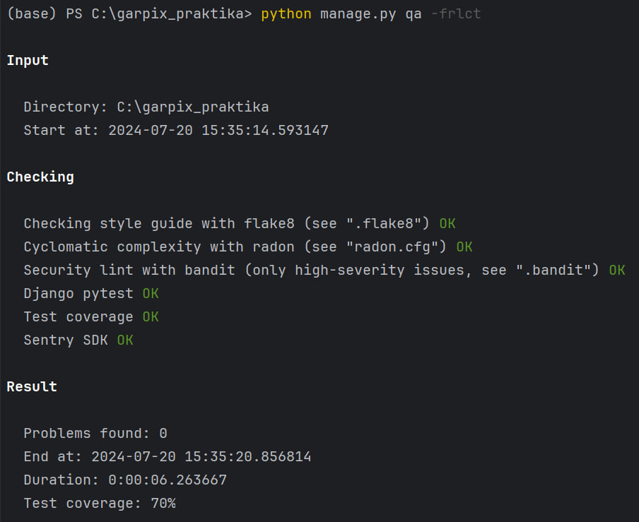
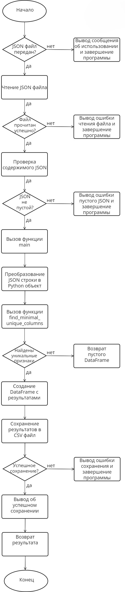

# Garpix практика
---
## Алгоритм выявления минимального набора уникальных признаков, которые однозначно идентифицируют каждую строку в наборе данных.

### Основные компоненты
---
- **lib/** - папка, содержащая основные конфигурационные файлы и модули DJANGO проекта.
- **app.py** - основной скрипт, который обрабатывает JSON данные, находит уникальные признаки и сохраняет результаты в CSV файл.
- **garpix.json** - json файл с данными для тестирования.
- **requirements.txt** - файл, с перечислением зависимостей.
- **result.csv** - итоговый CSV файл, в который созраняется результат с уникальными признаками.
- **test_app.py** - набор тестов для проверки корректности работы функций в app.py.

### Файл app.py
---
Функция **find_minimal_unique_columns**
---
Эта функция ищет минимальный набор признаков, который может уникально идентифицировать каждую строку в наборе данных.

**Параметры**:
- *data* - список словарей, представляющих строки данных.

**Возвращает**:
- Список колонок, который минимально необходим для уникальной идентификации каждой строки.

**Алгоритм**:
1. Создается DataFrame из входных данных.
2. Проверяется, пустой ли DataFrame. Если пустой, возвращается пустой список.
3. Функция исследует различные подмножества признаков, начиная с минимального количества, то есть с 1, и проверяет, могут ли они уникально идентифицировать строки.
4. Как только найдено первое подмножество признаков, которое удовлетворяет этому критерию, функция немедленно возвращает его.

Функция **main**:
---
**Эта функция обрабатывает входные JSON данные, использует find_minimal_unique_columns для нахождения уникальных колонок и сохраняет результат в CSV файл.**

**Параметры**:
- **json_string** - строка в формате JSON, представляющая входные данные.

**Возвращает**:
- DataFrame с колонкой "Признак", содержащей уникальные колонки.

**Алгоритм**:
---
1. Загружаются данные из JSON строки.
2. Если данные пустые, выбрасывается ошибка.
3. Вызывается **find_minimal_unique_columns** для нахождения уникальных колонок.
4. Создается DataFrame с результатом.
5. Результат сохраняется в CSV файл.
6. DataFrame возвращается как результат работы функции.

### Файл test_app.py
---
**Этот файл содержит набор тестов для проверки корректности работы функций из app.py.**

Тесты для функции find_minimal_unique_columns:
1. **test_find_minimal_unique_columns**: Проверка на простом наборе данных.
2. **test_find_minimal_unique_columns_with_duplicates**: Проверка на наборе данных с дубликатами.
3. **test_find_minimal_unique_columns_multiple_columns**: Проверка на наборе данных с несколькими столбцами.
4. **test_find_minimal_unique_columns_empty_data**: Проверка на пустом наборе данных.
5. **test_find_minimal_unique_columns_single_column**: Проверка на наборе данных с одним столбцом.
6. **test_find_minimal_unique_columns_same_values**: Проверка на наборе данных с одинаковыми значениями.
7. **test_find_minimal_unique_columns_non_unique_but_different**: Проверка на наборе данных с неуникальными значениями, но разными идентификаторами.

Тесты для функции main:
1. **test_main_function**: Проверка на корректных JSON данных.
2. **test_main_function_empty_json**: Проверка на пустом JSON.
3. **test_main_function_invalid_json**: Проверка на некорректном JSON.
4. **test_main_function_no_unique_columns**: Проверка на данных без уникальных столбцов.

## Запуск и результаты
---
**Для запуска основного скрипта необходимо выполнить следующую команду**:
```commandline
python app.py garpix.json
```
При желании можно использовать другой JSON файл, прописав путь к нему и указать вместо garpix.json

**Результат**:


Данный результат сохраняется в файл result.csv

**Например при таком содержимом JSON файлы**:
```
[
    {"name": "Alice", "age": 30},
    {"name": "Bob", "age": 25},
    {"name": "Alice", "age": 25}
]
```
**Такой результат будет выведен и сохранится в result.csv**:
```
name
age
```

**Для запуска тестов используйте**:
```commandline
python -m unittest test_app.py
```
**Результат**:


**Для запуска тестов с помощью eqator используйте**:
```commandline
python manage.py qa -frlct
```
**Результат**:


## **Описание разработанного алгоритма в соответствии с требованиями ГОСТ 19.701-90.**
---

